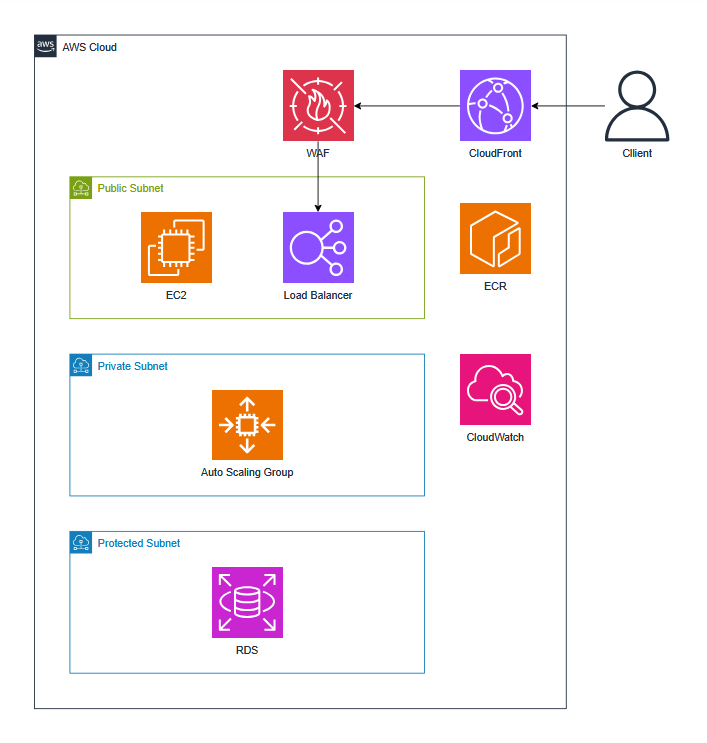

# Building a 3 Tier Architecture on AWS Services
---
### Architecture


<br>

**Use Skills**
```shell
AWS                        Application/Framework
- VPC                         - Python/Flask
 - EC2
 - Load Balancer
 - Auto Scaling Group
 - RDS
 - ECR
 - CloudWatch
 - WAF
```

<br>

**Set Up**
```
git clone https://github.com/Daliy-Cloud/3-Tier-Architecture.git
mv 3-Tier-Architecture.git/src/* ./
terraform init
terraform apply --auto-approve
```